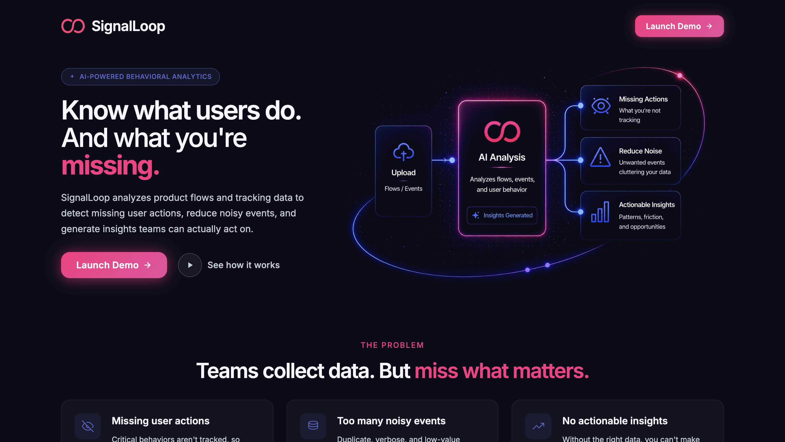
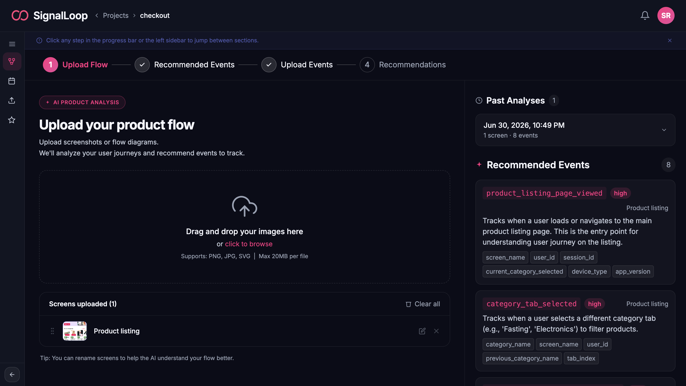
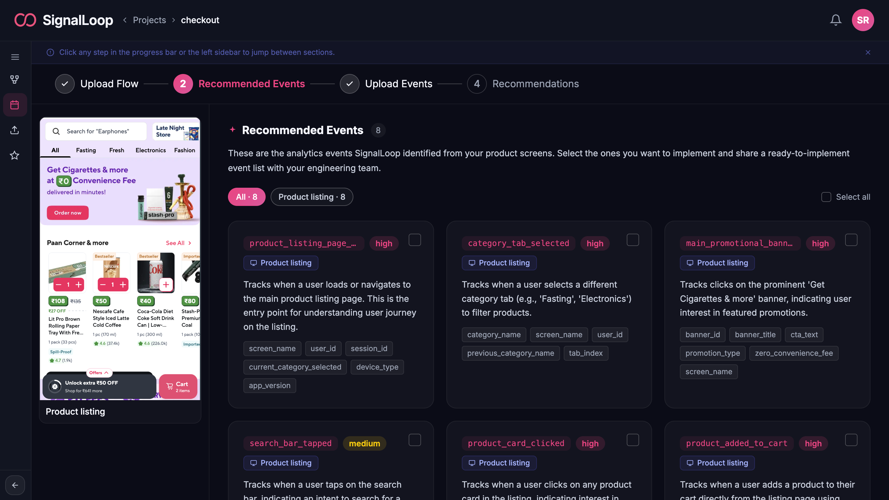
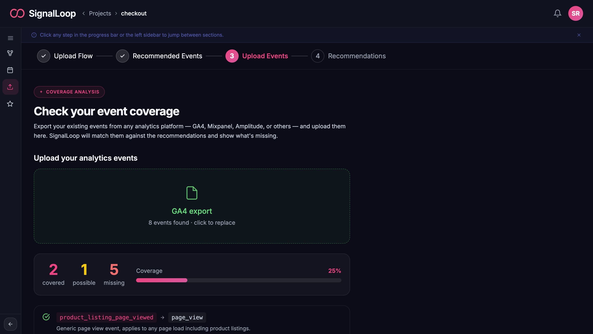
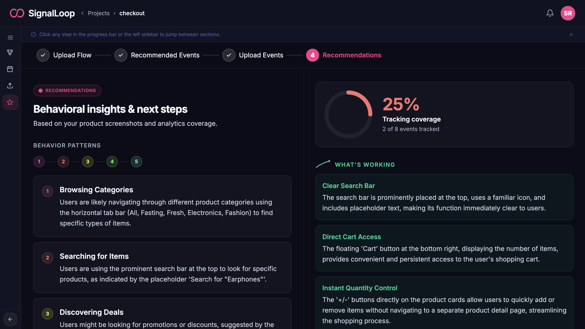

# SignalLoop

> AI-powered behavioral analytics — know what your users do, and what you're missing.

[](https://deepmind.google/technologies/gemini/)
[](https://www.nvidia.com/)
[](https://cloud.google.com/run)
[](https://vuejs.org/)

**Live demo →** https://signalloop-1076153819107.asia-southeast1.run.app

*Built for the Google × NVIDIA Hackathon 2025*

---

## Screenshots

**Home**


**Upload your product screens**


**AI-recommended events with properties and priority**


**Event coverage gap analysis**


**Behavioral insights and next steps**


---

## The Problem

Most product teams collect analytics data but never know what they're *missing*. Which user actions go untracked? Which flows have blind spots? Where are the real drop-offs? Without the right events in place, you can't answer these questions — and no one has time to manually audit every screen.

## What SignalLoop Does

SignalLoop takes screenshots of any product flow and uses **Gemini AI** to read every screen — the buttons, labels, interactions, and user journey — then tells you exactly which analytics events you should be tracking, what properties to capture, and what your current implementation is missing.

Upload your existing events from **GA4, Mixpanel, or Amplitude** and get a GPU-accelerated coverage gap analysis in milliseconds. Product managers get behavioral insights they can act on. Engineers get a ready-to-implement event list with zero ambiguity.

---

## Features

- **AI Screen Analysis** — Gemini reads your product screenshots and identifies every trackable user action
- **Event Recommendations** — Event names, properties, priority levels, and descriptions ready for engineering handoff
- **Coverage Gap Analysis** — Compare AI recommendations against your existing analytics events to find what's missing
- **GPU Acceleration** — NVIDIA cuDF (RAPIDS) processes large event datasets up to 10× faster than CPU
- **Behavioral Insights** — Friction points, behavior patterns, and prioritized next steps for product managers
- **Multi-platform Support** — Works with GA4, Mixpanel, Amplitude, or any CSV/Excel/JSON export
- **Download & Share** — Export your event list as JSON or CSV to share with your engineering team

---

## Try It Yourself

1. Go to the **[live demo](https://signalloop-1076153819107.asia-southeast1.run.app)** and create a project
2. Upload **3–5 screenshots** of any mobile or web app (your own product, or any app you use)
3. Name each screen (e.g. "Home", "Product Listing", "Checkout")
4. Click **Analyze Product Flow** — Gemini will generate recommended events in ~30 seconds
5. Download the [sample GA4 events file](https://signalloop-1076153819107.asia-southeast1.run.app/sample-ga4-events.csv) and upload it on step 3 to see the coverage gap analysis
6. Go to step 4 to see behavioral insights and friction points

> Works best with 3–10 screens from a single user journey (e.g. onboarding, checkout, search).

---

## How It Works

```
Upload Screens → Gemini AI Analysis → Recommended Events → Coverage Check → Insights
      ↓                  ↓                    ↓                   ↓              ↓
  PNG/JPG/SVG     Reads UI elements     Event taxonomy      NVIDIA cuDF     PM action plan
                  & user flows          + properties        gap matching
```

1. **Upload Flow** — Drop in screenshots of any product screen or user journey
2. **Recommended Events** — Gemini analyzes every screen and generates a full event taxonomy
3. **Upload Events** — Upload your existing analytics export; NVIDIA cuDF matches it against recommendations
4. **Recommendations** — Behavioral insights, friction points, and next steps your PM team can act on today

---

## Tech Stack

| Layer | Technology |
|---|---|
| Frontend | Vue 3, TypeScript, Vite, Tailwind CSS v4 |
| Backend | Node.js, Express, TypeScript |
| AI | Google Gemini (Vertex AI Agent Platform) |
| GPU | NVIDIA cuDF (RAPIDS) on Cloud Run L4 GPU |
| Storage | Google Cloud Storage, BigQuery |
| Infrastructure | Google Cloud Run |

---

## Getting Started

### Prerequisites

- Node.js 22+
- Google Cloud project with Gemini API and BigQuery enabled
- A GCS bucket for screenshot storage
- `gcloud` CLI authenticated

### Environment Variables

Copy `.env.example` to `.env`:

```bash
cp .env.example .env
```

| Variable | Description |
|---|---|
| `VITE_GEMINI_API_KEY` | Gemini API key (frontend) |
| `GEMINI_API_KEY` | Gemini API key (server) |
| `GCP_PROJECT` | Google Cloud project ID |
| `GCS_BUCKET` | Cloud Storage bucket name |
| `BQ_DATASET` | BigQuery dataset name |
| `GPU_SERVICE_URL` | URL of the deployed GPU service |

### Local Development

```bash
git clone https://github.com/canaalex/signal-loop.git
cd signal-loop
npm install
cp .env.example .env
# Fill in your environment variables
npm run dev
```

---

## Deployment

### Frontend + Backend (Cloud Run)

```bash
gcloud run deploy signalloop \
  --source . \
  --region asia-southeast1 \
  --set-env-vars "GEMINI_API_KEY=your_key,GPU_SERVICE_URL=your_gpu_url" \
  --allow-unauthenticated
```

### GPU Service (NVIDIA cuDF)

```bash
cd gpu_service
gcloud run deploy signalloop-gpu \
  --source . \
  --region asia-southeast1 \
  --gpu=1 \
  --gpu-type=nvidia-l4 \
  --no-cpu-throttling \
  --min-instances=1 \
  --allow-unauthenticated
```

---

## Known Limitations

- Analysis works best with **3–10 screens** from a single user flow
- The GPU service has a **~30 second cold start** if it hasn't been used recently
- Screenshot analysis is optimized for **mobile and web UI** — it works less well on charts, dashboards, or non-UI images
- Coverage matching uses AI similarity, not exact string matching — results may vary for unusual event naming conventions

---

## Project Structure

```
src/
├── components/          # Step components
│   ├── UploadFlowStep.vue
│   ├── RecommendedEventsStep.vue
│   ├── UploadEventsStep.vue
│   └── RecommendationsStep.vue
├── views/
│   ├── HomePage.vue
│   ├── ProjectsPage.vue
│   └── ProjectPage.vue  # Orchestrates all steps + shared state
├── types/
│   └── project.ts       # Shared TypeScript interfaces
└── router/
    └── index.ts
gpu_service/
├── main.py              # FastAPI + NVIDIA cuDF
└── Dockerfile
```
